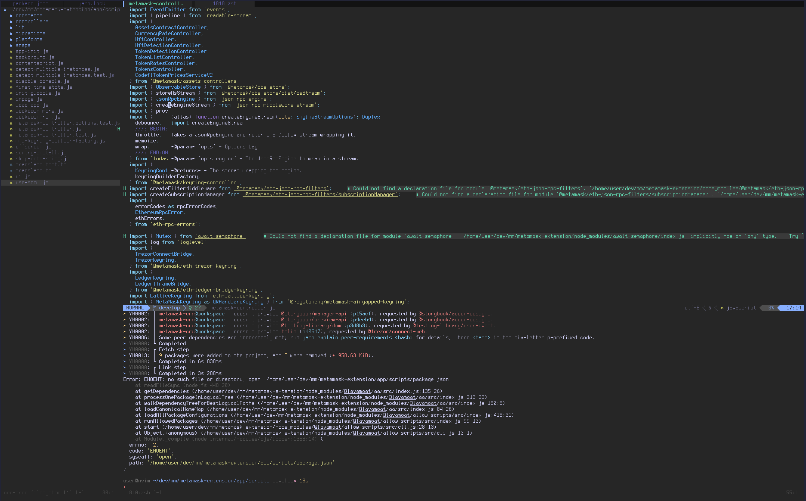
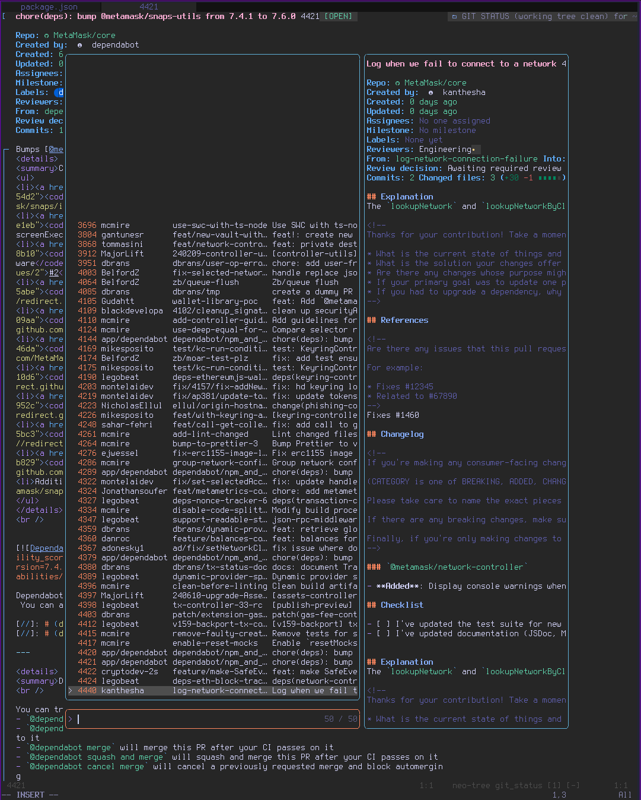

# `l7ide`

Containerized neovim development environment. Primarily intended for contributors on [MetaMask](https://github.com/MetaMask) repositories.

For a guided tutorial, see [`docs/1-getting-started.md`](docs/1-getting-started.md).

## Goals
- Ease-of-use
  - Quick and easy to set up with minimal configuration and sane defaults
  - Easy to maintain and update at your leisure
  - Easily extensible, configurable and customizable
  - Adapted for contribution to MetaMask and LavaMoat codebases
  - Familiar setup for vscode/vim users
- Secure
  - Principle-of-least privilege applied
    - Text editor and plugins shouldn't need access to secrets like GitHub tokens
    - Keep development scripts and code-scanning tools away from each other and your home directory
  - Sandbox from rest of host system
    - Paste raw logs without exposing information about your user and host
  - Ephemeral file system
    - Everything beyond your sources and configuration are a clean slate after a restart
  - Auditable
- Fast and efficient
  - Low performance overhead - save your memory and CPU for more interesting work
- Productivity-enhanching
  - Code-analysis and refactoring features familiar for IDE users

## Dependencies
- OCI Container runtime
  - We will be using rootless podman to minimize privileges but Docker or any other compatible engine should work.
- An SSH agent socket
  - Typically provided by running `ssh-agent`
- (Optional) A GPG agent socket
  - For signing git commits. Typically provided by running `gpg-agent` on the host.

## Screenshots

## Contribution Notes

> ⚠️ This is under early development and things might still shift around a bit. Open an [issue](issues/new) if you have any!

PRs with bugfixes, compatibility improvements, documentation and testing are especially welcome. New features may be considered but if they conflict with goals, you are also encouraged to run your own fork.
